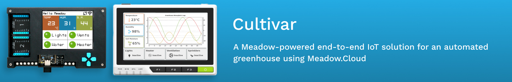
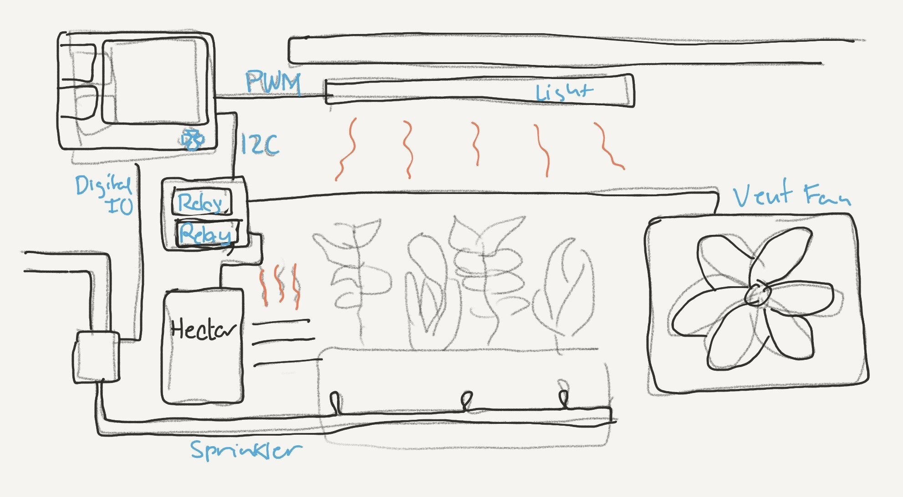
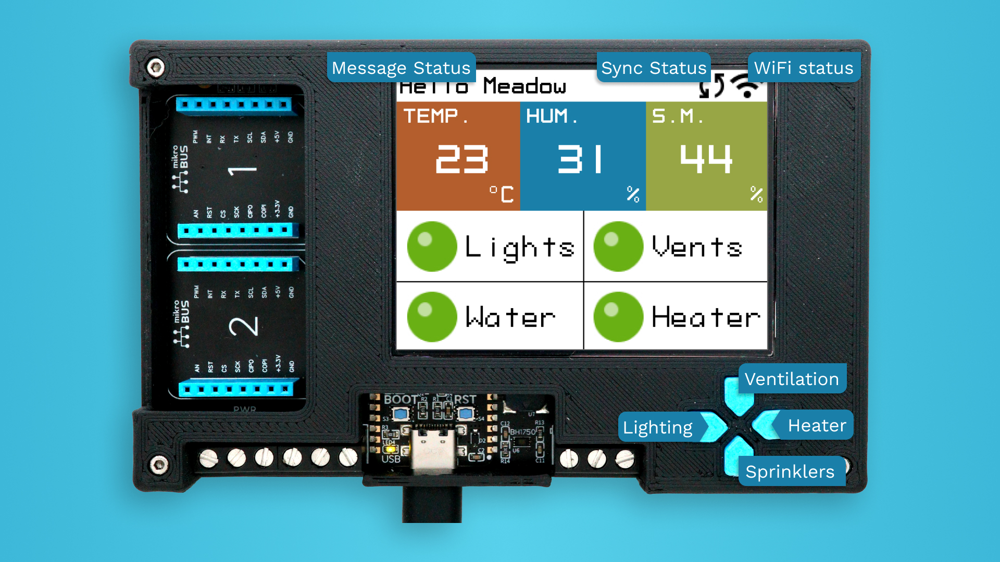
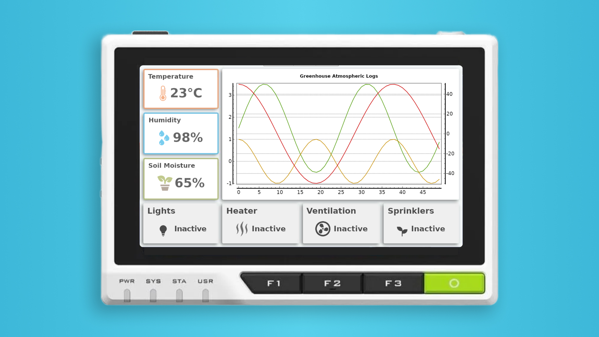

# Cultivar

## Contents
* [Overall Concept](#overall-concept)
* [Meadow Application](#meadow-application)
* [HMI reTerminal Application](#hmi-reterminal-application)
* [Support](#support)

## Overall Concept

The concept to automate a basic greenhouse, consists on controlling four peripherals:

* A light bulb to give the appropriate amount of light for the plants health growth throughout the entire year.
* Sprinkler system to water the plants and keep the soil moist.
* Heater and Ventilation fan to control and maintain an appropriate room temperature.

Here's a sketch of Cultivar:

On the top right we have a [Project Lab](https://store.wildernesslabs.co/collections/frontpage/products/project-lab-board) which is in charge of controlling the whole system, and all four peripherals mentioned above are connected to it, some indirectly with a relay module in the middle to turn on or off things like the heater and the ventilation fan.

Not only the Project Lab is controlling these four peripherals, it's using its onboard BME688 environmental sensor to check the greenhouse's temperature and humidity, and soil moisture sensors to control how much the plants need to be watered.

Additionally, the Project Lab is connected to a WiFi and periodically sending data from the sensors and the current status of all its peripherals over to [Meadow.Cloud](https://www.meadowcloud.co), which in turn, sends them to a Digital Twin on Microsoft Azure.

Having a virtual representation of the Cultivar Meadow application in an Azure Digital Twin lets you monitor and control your Greenhouse from anywhere on the planet using any application that connects to it, which in this case, we built an HMI app using [Avalonia](https://avaloniaui.net/) on a [reTerminal](https://wiki.seeedstudio.com/reTerminal_Intro/) by SeeedStudio.

## Meadow Application

Above you can see [Cultivar's Meadow application](/source/apps/Cultivar/Apps/Cultivar.MeadowApp/) running on a Project Lab v3 (minus the connections to the Soil Moisture sensor and a relay module to control the greenhouse peripherals). On its display we have an HMI built using MicroLayouts to show sensor values such as room temperature and humidity, and the soil moisture measured by a Capacitive soil moisture sensor.

This Meadow application also lets you toggle on and off the Lights, Heater, Sprinklers and Ventilation fan using the directional D-Pad push buttons on the Project Lab.

## HMI reTerminal Application

This [HMI Cultivar](/source/apps/Cultivar_reTerminal/) project periodically queries the Project Lab's Digital Twin on Azure to refresh the latest conditions and status of all the equipment in the greenhouse, at the same time it queries the logs conditions to graph them to have an idea of how the system is doing over time. Since its an avalonia application, it can run on any linux device (in this case a reTerminal), macOS and Windows machines.

## Support

* Join our [public Slack](http://slackinvite.wildernesslabs.co/), where we have an awesome community helping, sharing and building amazing things using Meadow.
